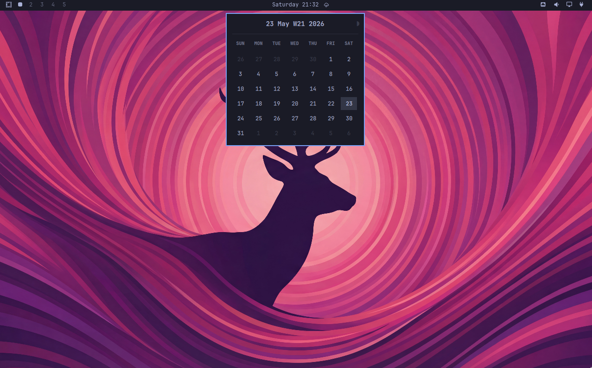

# Omarchy Plugins

## Omacal

Omacal is a drop-in replacement for the default Omarchy clock that adds mini calendar functionality. The calendar supports keyboard controls (including vim bindings) for browsing month and year.



## Install

```bash
omarchy plugin source add https://github.com/brianblakely/omarchy-plugins.git --as b
omarchy plugin available
omarchy plugin add b.omacal --from b --review --enable
```

For unattended installs:

```bash
omarchy plugin source add https://github.com/brianblakely/omarchy-plugins.git --as b --yes
omarchy plugin add b.omacal --from b --enable --yes
```

## Update

```bash
omarchy plugin update b.omacal
```

## Shortcuts

```lua
foo
o.bind("SUPER + CTRL + ALT + T", "Flash mini calendar", "omarchy-shell b.omacal flash")
o.bind("SUPER + F9", "Toggle mini calendar", "omarchy-shell b.omacal toggle")
o.bind("SUPER + ALT + F9", "Open mini calendar", "omarchy-shell b.omacal open")
o.bind("SUPER + CTRL + F9", "Close mini calendar", "omarchy-shell b.omacal close")
```

Right-clicking the clock will allow you to change timezone, exactly like the default Omarchy clock.

## Omastonk

Omastonk is a bar widget for a selected market symbol. It starts with no selected symbol; click the widget to enter one. Each widget instance stores its symbol inline on that bar entry in `~/.config/omarchy/shell.json`, so multiple Omastonk instances can track different symbols.

After a symbol is set, Omastonk fetches quote data with `curl` from Yahoo Finance and refreshes once per minute.

## Install Omastonk

```bash
omarchy plugin source add https://github.com/brianblakely/omarchy-plugins.git --as b
omarchy plugin available
omarchy plugin add b.omastonk --from b --review --enable
```

For unattended installs:

```bash
omarchy plugin source add https://github.com/brianblakely/omarchy-plugins.git --as b --yes
omarchy plugin add b.omastonk --from b --enable --yes
```

## Update Omastonk

```bash
omarchy plugin update b.omastonk
```

## Validate Omastonk From Source

```bash
omarchy plugin validate ./omastonk
```
