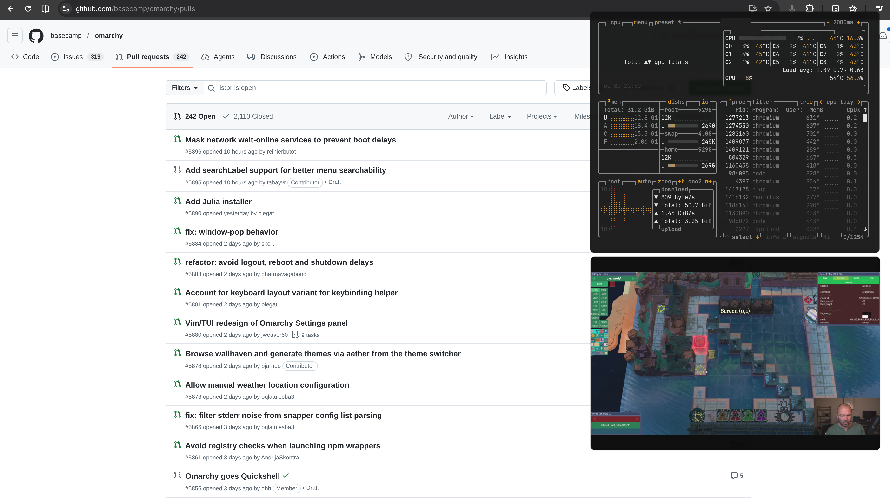

# Omarchy Plugins

* [Omacal](#omacal) - Drop-in clock replacement with mini calendar
* [Omastonk](#omastonk) - Stock tickers in the Omarchy bar, with charts
* [Omanote](#omanote) - Secure scratch note in the Omarchy bar
* [Omanews](#omanews) - Headlines in the Omarchy bar, with instant access to commentary
* [OmaLED](#omaled) - Dim the Omarchy bar when not in use
* [Peek](#peek) - Peek behind floating Hyprland windows

## Omacal

Omacal is a drop-in replacement for the default Omarchy clock that adds a mini calendar. The calendar supports keyboard controls (including vim bindings) for browsing month and year.


### Install

```bash
omarchy plugin source add https://github.com/brianblakely/omarchy-plugins.git --as b
omarchy plugin available
omarchy plugin add b.omacal --from b --review --enable
```

Set `"centerAnchor": "b.omacal"` in `~/.config/omarchy/shell.json`.

For unattended installs:

```bash
omarchy plugin source add https://github.com/brianblakely/omarchy-plugins.git --as b --yes
omarchy plugin add b.omacal --from b --enable --yes
```

### Update

```bash
omarchy plugin update b.omacal
```

### Shortcuts

```lua
hl.unbind("SUPER + CTRL + ALT + T")
o.bind("SUPER + CTRL + ALT + T", "Flash mini calendar", "omarchy-shell b.omacal flash")
o.bind("SUPER + F9", "Toggle mini calendar", "omarchy-shell b.omacal toggle")
o.bind("SUPER + ALT + F9", "Open mini calendar", "omarchy-shell b.omacal open")
o.bind("SUPER + CTRL + F9", "Close mini calendar", "omarchy-shell b.omacal close")
```

Right-clicking the clock will allow you to change timezone, exactly like the default Omarchy clock.

## Omastonk

Omastonk is a bar widget for a selected market symbol. It starts with no selected symbol; click the widget to enter one. Each widget instance stores its symbol inline on that bar entry in `~/.config/omarchy/shell.json`, so multiple Omastonk instances can track different symbols.

After a symbol is set, click the bar widget to display the chart panel, which supports keyboard controls (including vim bindings) for switching intervals. Right-click the bar widget to change symbol.


### Install

```bash
omarchy plugin source add https://github.com/brianblakely/omarchy-plugins.git --as b
omarchy plugin available
omarchy plugin add b.omastonk --from b --review --enable
```

For unattended installs:

```bash
omarchy plugin source add https://github.com/brianblakely/omarchy-plugins.git --as b --yes
omarchy plugin add b.omastonk --from b --enable --yes
```

### Update

```bash
omarchy plugin update b.omastonk
```

## Omanote

Omanote displays a note icon in the Omarchy bar. Click it or activate a binding to open a scratch note panel.

The note is stored securely with the desktop Secret Service through `secret-tool`, using the attributes `omarchy-plugin=b.omanote` and `field=note`. During automatic saves, Omanote writes the note to a short-lived file in `$XDG_RUNTIME_DIR`, pipes that file into `secret-tool store`, and deletes the runtime file immediately after the keyring store command exits. No note text is stored in `~/.config/omarchy/shell.json`.

Omanote runs `bash` and `secret-tool`. It does not use the network.


### Install

```bash
omarchy plugin source add https://github.com/brianblakely/omarchy-plugins.git --as b
omarchy plugin available
omarchy plugin add b.omanote --from b --review --enable
```

For unattended installs:

```bash
omarchy plugin source add https://github.com/brianblakely/omarchy-plugins.git --as b --yes
omarchy plugin add b.omanote --from b --enable --yes
```

### Update

```bash
omarchy plugin update b.omanote
```

### Shortcuts

```lua
o.bind("SUPER + F8", "Toggle Omanote", "omarchy-shell b.omanote toggle")
o.bind("SUPER + ALT + F8", "Open Omanote", "omarchy-shell b.omanote open")
o.bind("SUPER + CTRL + F8", "Close Omanote", "omarchy-shell b.omanote close")
```

## Omanews

Omanews is a headline ticker for the Omarchy bar. It displays top headlines from Google News; additional headlines every 10 minutes. Left-click advances to the next headline, right-click goes to the previous headline, and middle-click opens an X search for the current headline.


### Install

```bash
omarchy plugin source add https://github.com/brianblakely/omarchy-plugins.git --as b
omarchy plugin available
omarchy plugin add b.omanews --from b --review --enable
```

For unattended installs:

```bash
omarchy plugin source add https://github.com/brianblakely/omarchy-plugins.git --as b --yes
omarchy plugin add b.omanews --from b --enable --yes
```

### Update

```bash
omarchy plugin update b.omanews
```

### Shortcuts

```lua
o.bind("SUPER + F10", "Next headline", "omarchy-shell b.omanews next")
o.bind("SUPER + ALT + F10", "Previous headline", "omarchy-shell b.omanews previous")
o.bind("SUPER + CTRL + F10", "Search headline on X", "omarchy-shell b.omanews search")
```

## OmaLED

OmaLED heavily dims the Omarchy bar when not in use. The bar will un-dim when the mouse cursor touches the bar or [a shortcut is triggered](#shortcuts-3).

**NOTE:** OmaLED will not work when the Omarchy bar's background is transparent (double-click the bar's background to cycle its color).


### Install

```bash
omarchy plugin source add https://github.com/brianblakely/omarchy-plugins.git --as b
omarchy plugin available
omarchy plugin add b.omaled --from b --review --enable
omarchy restart shell
```

For unattended installs:

```bash
omarchy plugin source add https://github.com/brianblakely/omarchy-plugins.git --as b --yes
omarchy plugin add b.omaled --from b --enable --yes
omarchy restart shell
```

### Update

```bash
omarchy plugin update b.omaled
```

### Shortcuts

```lua
o.bind("SUPER + CTRL + F11", "Toggle OmaLED", "omarchy-shell b.omaled toggle")
```

## Peek

Fade out floating windows and interact with content below. [Bind a shortcut](#shortcuts-4) to use Peek.




### Install

```bash
omarchy plugin source add https://github.com/brianblakely/omarchy-plugins.git --as b
omarchy plugin available
omarchy plugin add b.peek --from b --review --enable
```

For unattended installs:

```bash
omarchy plugin source add https://github.com/brianblakely/omarchy-plugins.git --as b --yes
omarchy plugin add b.peek --from b --enable --yes
```

### Update

```bash
omarchy plugin update b.peek
```

### Shortcuts

```lua
o.bind("SUPER + GRAVE", "Toggle floating window peek", "omarchy-shell b.peek toggle")
o.bind("SUPER + ALT + GRAVE", "Enable floating window peek", "omarchy-shell b.peek enable")
o.bind("SUPER + CTRL + GRAVE", "Disable floating window peek", "omarchy-shell b.peek disable")
```
