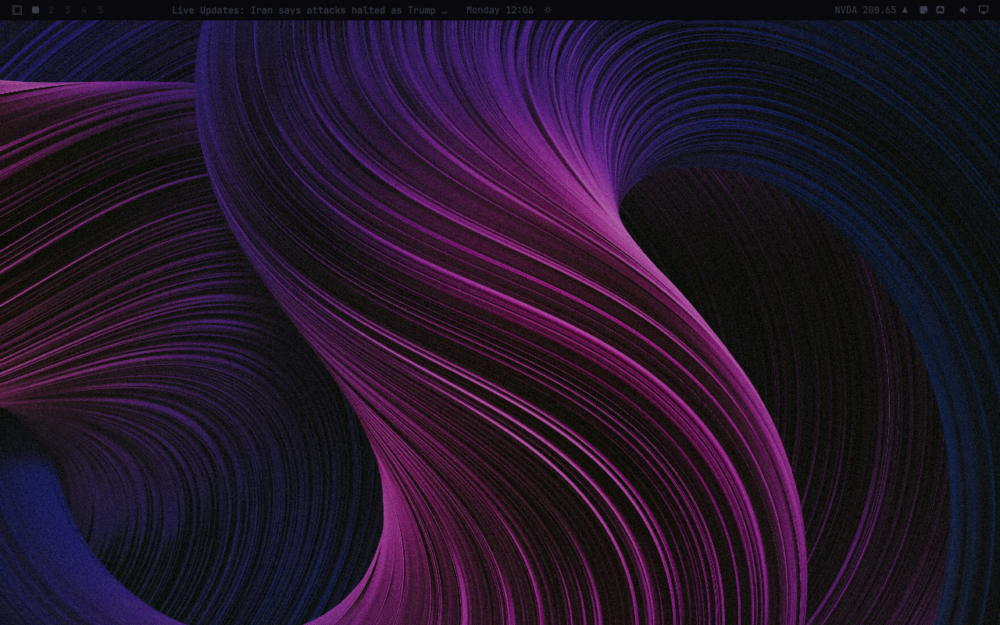

# OmaLED

OmaLED heavily dims the Omarchy bar when it is not in use. The bar returns to full brightness when the pointer touches it or the service is toggled.



OmaLED cannot visibly dim a transparent bar. Double-click the bar background to turn transparency off.

## Install

Install OmaLED disabled so you can review it before it runs:

```bash
omarchy plugin add https://github.com/brianblakely/omaled.git --no-enable
```

Review the installed checkout:

```bash
omarchy plugin edit b.omaled
```

Then enable it:

```bash
omarchy plugin enable b.omaled
```

## Optional shortcut

Global keybindings remain user-owned. Add this to your Hyprland bindings if desired:

```lua
o.bind("SUPER + CTRL + F11", "Toggle OmaLED", "omarchy-shell b.omaled toggle")
```

## Behavior

While its hover overlay is active, OmaLED polls `hyprctl cursorpos` four times per second. Its IPC settings write `enabled`, `opacity`, and `color` to the plugin's inline entry in `~/.config/omarchy/shell.json`. It does not use the network.

Plugins run unsandboxed inside `omarchy-shell`; review the checkout before enabling it.

## Update

```bash
omarchy plugin update b.omaled
```

## License

[MIT](LICENSE)
