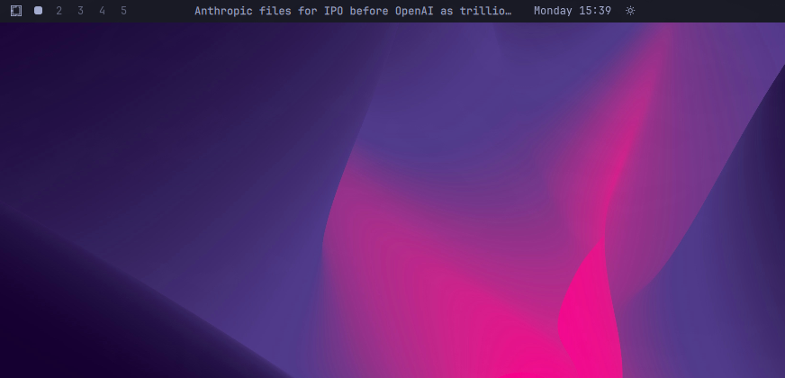

# Omanews

Omanews is a Google News headline ticker for the Omarchy bar. Left-click advances to the next headline, right-click returns to the previous headline, and middle-click opens an X search for the current headline.



## Install

Install Omanews disabled so you can review it before it runs:

```bash
omarchy plugin add https://github.com/brianblakely/omanews.git --no-enable
```

Review the installed checkout:

```bash
omarchy plugin edit b.omanews
```

Then enable it in the right bar section:

```bash
omarchy plugin enable b.omanews --section right
```

## Optional shortcuts

Global keybindings remain user-owned. Add any of these to your Hyprland bindings:

```lua
o.bind("SUPER + F10", "Next headline", "omarchy-shell b.omanews next")
o.bind("SUPER + ALT + F10", "Previous headline", "omarchy-shell b.omanews previous")
o.bind("SUPER + CTRL + F10", "Search headline on X", "omarchy-shell b.omanews search")
```

## Behavior

Omanews runs `curl` against Google News RSS, refreshes every ten minutes, and opens X searches in the default browser. It does not write files.

The widget recognizes inline `feedUrl`, `limit`, and `maxWidth` settings.

Plugins run unsandboxed inside `omarchy-shell`; review the checkout before enabling it.

## Update

```bash
omarchy plugin update b.omanews
```

## License

[MIT](LICENSE)
